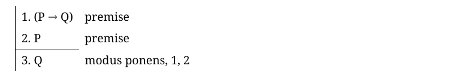
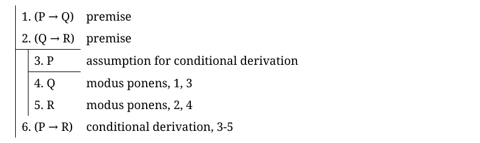
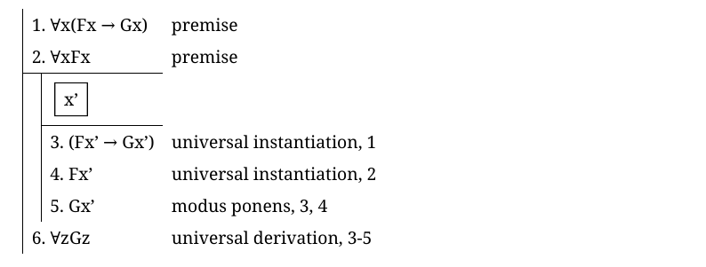

# deutil

Tools for working with DeLancy-style proofs in first-order logic and propositional logic, including converting proofs in
markdown to PDF, checking proofs for correctness, and finding countermodels.
Based on DeLancy's *A Concise Introduction to Logic*.

## Installation

```
$ pip install deutil
```

or:

```
$ git clone https://github.com/maxcutlyp/deutil.git
$ cd deutil
$ pip install -e .
```

## Tools

### `deutil convert`

Convert a markdown file containing proofs to a PDF file and check the proofs for correctness.

```
$ deutil convert input.md output.pdf
```

Proofs should look like this:

```
| 1. (P -> Q)   premise
| 2. P          premise
|-
| 3. Q          modus ponens, 1, 2
```

Which will create a PDF containing the following:



Proofs can contain nested subproofs:

```
| 1. (P -> Q)   premise
| 2. (Q -> R)   premise
|-
| | 3. P        assumption for conditional derivation
| |-
| | 4. Q        modus ponens, 1, 3
| | 5. R        modus ponens, 2, 4
| 6. (P -> R)   conditional derivation, 3-5
```



The following special characters are converted to symbols in the PDF output:

| From: | To: |
| ----- | --- |
| `^`   | `∧` |
| `v`   | `∨` |
| `->`  | `→` |
| `<->` | `↔` |
| `~`   | `¬` |
| `\V`  | `∀` |
| `\E`  | `∃` |
| `'`   | `’` |

When defining abstract terms, surround them with `[` `]` to put a box around them:

```
| 1. \Vx(Fx -> Gx)   premise  
| 2. \VxFx           premise
|-
| | [x']
| |-
| | 3. (Fx' -> Gx')  universal instantiation, 1
| | 4. Fx'           universal instantiation, 2
| | 5. Gx'           modus ponens, 3, 4
| 6. \VzGz           universal derivation, 3-5
```



Before being converted, proofs will be checked for correctness. You can disable this behaviour with `--no-check`. It is
imperfect - see *known limitations* below - but it will catch most errors.

The proof checker takes into account justifications. The only permitted justifications are those mentioned in DeLancy's book,
particularly those listed in Chapter 16. This means that order matters! For example, the folowing would throw an error:

```
| 1. P          premise
| 2. (P -> Q)   premise
|-
| 3. Q          modus ponens, 1, 2
```

To correct it, you would need either to swap the first two lines or to change the justification on line 3 to `modus ponens, 2, 1`.

It should also be noted that parentheses are required for all binary connectives. For example, the following would throw an error on line 1:

```
| 1. P -> Q     premise
| 2. P          premise
|-
| 3. Q          modus ponens, 1, 2
```


#### Proof checker - known limitations

If you find any bugs in the proof checker other than the ones mentioned below, please [raise an issue](https://github.com/maxcutlyp/deutil/issues/new) with an example of a proof that demonstrates the bug.

1. Incorrect uses of symbolic terms in existential instantiations and universal instantiations are not caught. For example, the following is accepted, despite having an error on line 3 leading to an incorrect conclusion:

```
| 1. Fa             premise
| 2. \ExGx          premise
|-
| 3. Ga             existential instantiation, 2
| 4. (Fa ^ Ga)      adjunction, 1, 3
| 5. \Ex(Fx ^ Gx)   existential generalization, 4
```

Similarly with universal instantiation:

```
| 1. \VxFx   premise
|-
| 2. Fa      universal instantiation, 1
```

### `deutil countermodel`

Find a countermodel for a given argument form. You will be dropped into an interactive prompt where you can enter expressions in the format described above, each separated by a comma. The final expression will be treated as the conclusion, and the rest will be treated as premises.

If all expressions are in propositional logic, a truth table will be drawn and any countermodels will be highlighted in red.

If any expressions are in first-order logic, a countermodel will be searched for by brute-force enumeration of all possible models with size up to `len(constants) + len(quantifiers)`. If a countermodel is found, it will be printed in a human-readable format. If no countermodel is found, it does not necessarily mean that the argument form is valid - an infinite-sized countermodel or a countermodel larger than the search space may exist. This is because, for FOL, the problem of determining whether an argument form is valid is undecidable - but this tool can get most of the simple cases.

For example:

```
$ deutil countermodel
Entered countermodel repl. Press Ctrl+D to exit.
> \Vx(Fx -> Gx), \VxGx, \VxFx

Argument:
  ∀x(Fx → Gx)
  ∀xGx
  ⊢ ∀xFx

Searching for a countermodel...
Countermodel found:
  Fx0: False
  Gx0: True
```

This output means that in a domain containing a single element `x0`, where `Fx0` is false and `Gx0` is true, the premises will all be true but the conclusion will be false.

The format `x#` is used for additional elements in the domain which were not defined names in the input. For example:
